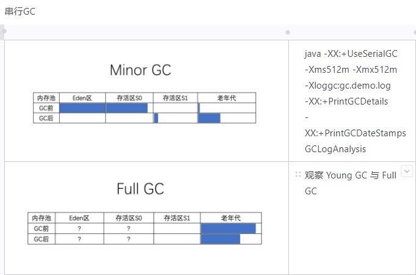
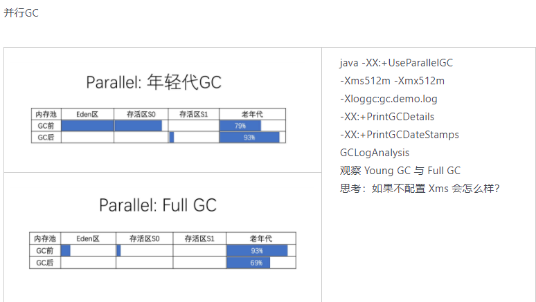
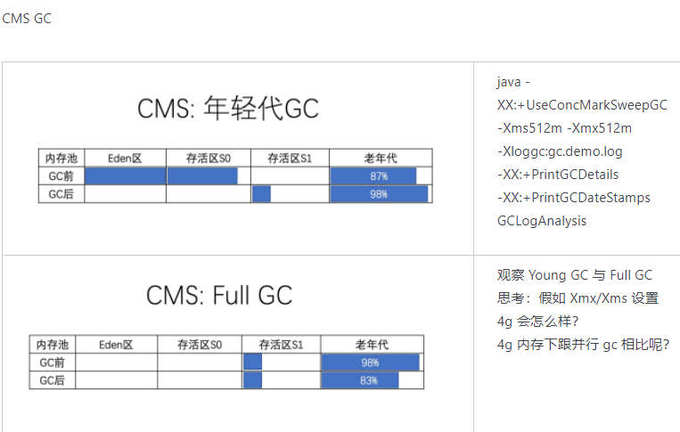
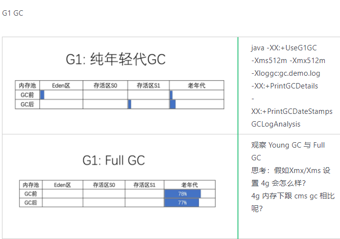

## 作业4. 

根据上述自己对于 1 和 2 的演示，写一段对于不同 GC 和堆内存的总结，提交到 GitHub。






## 作业6.

写一段代码，使用 HttpClient 或 OkHttp 访问 [http://localhost:8801](http://localhost:8801/) ，代码提交到 GitHub


在工程中的pom文件中加入如下依赖：

```java
<!-- https://mvnrepository.com/artifact/org.apache.httpcomponents/httpclient -->
<dependency>
   <groupId>org.apache.httpcomponents</groupId>
   <artifactId>httpclient</artifactId>
   <version>4.4.1</version>
</dependency>
<!-- https://mvnrepository.com/artifact/com.squareup.okhttp3/okhttp -->
<dependency>
   <groupId>com.squareup.okhttp3</groupId>
   <artifactId>okhttp</artifactId>
   <version>4.2.1</version>
</dependency>
```