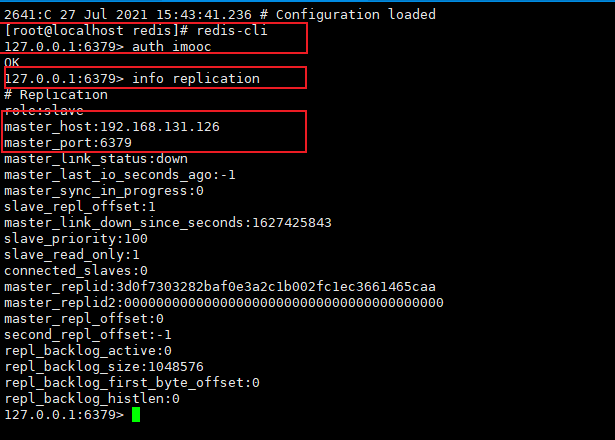
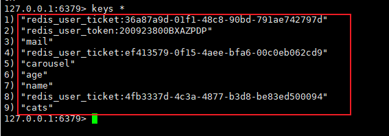
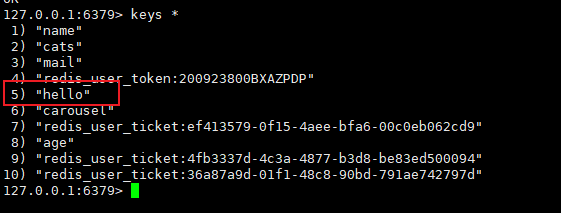
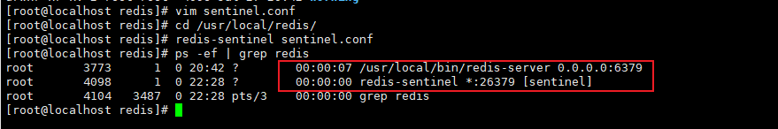

配置 redis 的主从复制，sentinel 高可用，Cluster 集群。

提交如下内容到 GitHub： 

1）config 配置文件，

2）启动和操作、验证集群下数据读写的命令步骤。


## 主从复制

1 进入到安装目录

```
cd /usr/local/redis
```

打开并编辑配置文件

```
vim redis.conf
```

修改配置文件后保存

```
# 设置主节点
replicaof 192.168.131.126 6379
# 设置密码
masterauth zeng
```


保存后退出

重启redis

```
/etc/init.d/redis_init_script stop
/etc/init.d/redis_init_script start
```

进入redis，查看相关结果信息



验证主从复制是否能正常使用

从节点原有信息：



在主节点，新增信息


在从节点查看相关信息




## sentinel  哨兵

进入redis安装目录，将配置文件文件拷贝一份到redis的安装目录

```
cd /home/software/redis
cp sentinel.conf /usr/local/redis/
```

打开复制后的该文件

```
vim sentinel.conf
```

```
# 打开注释(已修改)
protected-mode no
# 允许后台运行(已修改)
daemonize yes
#设置日志文件(已修改)
logfile "/usr/local/redis/sentinel/redis-sentinel.log"
#设置工作空间(已修改)
dir  "/usr/local/redis/sentinel"
# 修改核心配置，其中的IP地址为master的IP地址(已修改)
sentinel monitor mymaster 192.168.131.126 6379 2
#修改为mymaster的密码(已修改)
sentinel auth-pass mymaster root
# master被sentinel认定为失效的间隔时间
sentinel down-after-milliseconds mymaster 30000
# 剩余的slaves重新和新的master做同步的并行个数
sentinel parallel-syncs mymaster 1
# 主备切换的超时时间，哨兵要去做故障转移，这个时候哨兵也是一个进程，如果他没有去执行，超过这个时间后，会由其他的哨兵来处理
sentinel failover-timeout mymaster 180000
```

进入redis-sentinel  所在目录  

```
cd /usr/local/redis/
```

启动哨兵：

```
redis-sentinel sentinel.conf
```

ps -ef | grep redis 查看相应进程是否启动成功



如需配置更多哨兵，只需将配置好的配置文件拷贝到其它机器的相应目录即可


通过以下指令可远程传输文件

```
scp sentinel.conf root@192.168.131.126:/usr/local/redis/
```


## Cluster 集群

打开并修改redis配置文件

```
# 打开注释：开启集群模式
cluster-enabled yes
# 打开注释，该文件由redis自行维护
cluster-config-file nodes-201.conf
# 打开注释，可做适当修改：超时时间，超时则认为master宕机，主从切换
cluster-node-timeout 5000
# 打开注释：开启AOF
appendonly yes
```

进入workings文件夹，删除历史单机时的数据

```
cd working/
rm dump.rdb
rm appendonly.aof
```

重启redis即可

redis-cli --cluster -a <密码>  create ip1:port1 ip2:port2 ip3:port3 ip4:port4 ip5:port5 ip6:port6 --cluster-replicas 1


**检查集群信息**

redis-cli --cluster check 192.168.131.126:6380


## 总结

如问到问题，首先，可通过查看相应的log-日志文件，有时候，输出的内容，只是表面原因，而真正的原因，日志里说的很清楚。